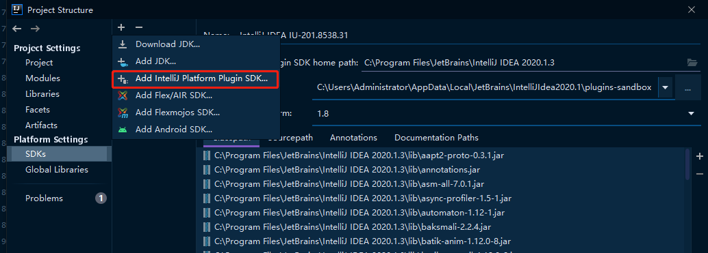
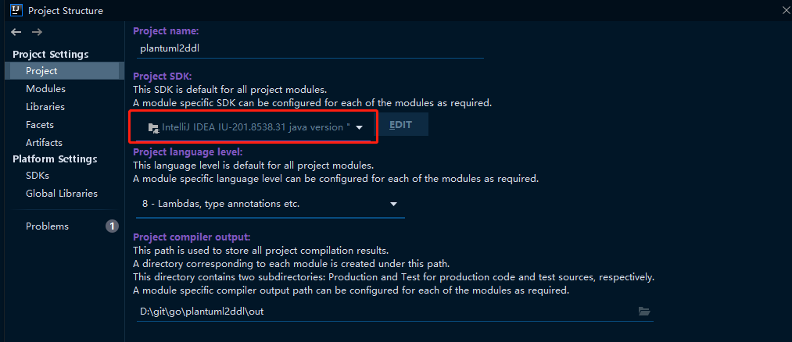
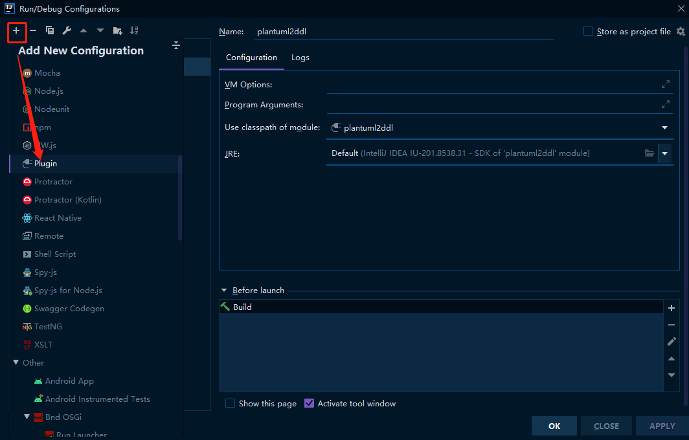
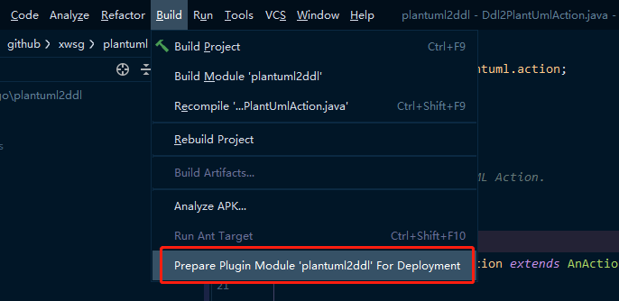

# PlantUML2DDL
Intellij IDEA 插件 [PlantUML2DDL](https://plugins.jetbrains.com/plugin/12801-plantuml2ddl) ，提供 MySQL/PostgreSQL DDL 和 PlantUML [Entity Relationship Diagram](http://plantuml.com/zh/ie-diagram) 互转功能. 

## 插件安装
插件商城安装或手动从硬盘安装，下载地址： [releases](https://github.com/xwsg/plantuml2ddl/releases)

## 标签定义
| 标签                               | 解释                                | 示例                                                                                                                                                                                                                                                                                                               |
|----------------------------------|-----------------------------------|------------------------------------------------------------------------------------------------------------------------------------------------------------------------------------------------------------------------------------------------------------------------------------------------------------------|
| \#                               | PRIMARY KEY                       | `#`id : bigint(20)                                                                                                                                                                                                                                                                                               |
| <\<pk>>                          | PRIMARY KEY                       | id : bigint(20) `<<pk>>`                                                                                                                                                                                                                                                                                         |
| \*                               | NOT NULL                          | `*`type : tinyint(4)                                                                                                                                                                                                                                                                                             |
| <\<notnull>>                     | NOT NULL                          | type : tinyint(4) `<<notnull>>`                                                                                                                                                                                                                                                                                  |
| <\<generated>>                   | AUTO_INCREMENT                    | #id : bigint(20) `<<generated>>`                                                                                                                                                                                                                                                                                 |
| <\<default:{DEFAULT_VALUE}>>     | DEFAULT {DEFAULT_VALUE}           | *name : varchar(50) `<<default:'anonymous'>>` <br> type : tinyint(4) `<<default:0>>`                                                                                                                                                                                                                             |
| --{COLUMN_COMMENT}               | column COMMENT '{COLUMN_COMMENT}' | *name : varchar(50) <\<default:'anonymous'>> `--用户名`                                                                                                                                                                                                                                                             |
| {TABLE_COMMENT} <br> --/../==/__ | table COMMENT '{TABLE_COMMENT}'   | entity "tbl_user" { <br> &nbsp;&nbsp;`用户表` <br> &nbsp;&nbsp;`--` <br> } <br> entity "tbl_user" { <br> &nbsp;&nbsp;`用户表` <br> &nbsp;&nbsp;`..` <br> } <br> entity "tbl_user" { <br> &nbsp;&nbsp;`用户表` <br> &nbsp;&nbsp;`==` <br> }  <br> entity "tbl_user"  { <br> &nbsp;&nbsp;`用户表` <br> &nbsp;&nbsp;`__` <br> } |

## 使用说明
### PlantUML 转 DDL
1. 打开 PlantUML 文件
2. 文件中, 右键或使用快捷键 Alt+Insert
3. 选择  `Generate` -> `PlantUML -> MySQL` or `PlantUML -> PostgreSQL`.

例如文件: `mall.puml`
```
@startuml

' hide the spot
hide circle

' avoid problems with angled crows feet
skinparam linetype ortho

entity "tbl_user" as user {
  用户表
  --
  #id : bigint(20) <<generated>>
  --
  *type : tinyint(4) <<default:0>> --用户类型：0-PC用户,1-移动端用户
  *name : varchar(50) <<default:'anonymous'>> --用户名
  description : varchar(200) <<default:'some string'>> --用户描述
}

entity "tbl_order" as order {
  订单表
  ==
  #id : bigint(20) <<generated>>
  --
  * **order_number** : varchar(20)  <<default:'0'>> -- 订单号
  *user_id : bigint(20) <<FK>> <<default:0>> -- 用户id
  *item_id: bigint(20) <<FK>> <<default:0>> -- 商品id
}

entity "tbl_item" as item {
  商品表
  ..
  #id : bigint(20)  <<generated>>
  --
  title : varchar(50)  <<default: 'wahaha'>> <<notnull>> -- 商品标题
  *price : int(11) <<default: 0>> -- 商品价格
}

user }|..|{ order
item }|..|{ order

@enduml
```


执行完成会在相同目录下生成 `mall_{yyyyMMddHHmmss}.sql` 文件，文件内容如下：

```
CREATE TABLE IF NOT EXISTS `tbl_user` (
    `id` BIGINT(20) NOT NULL AUTO_INCREMENT,
    `type` TINYINT(4) NOT NULL DEFAULT 0 COMMENT '用户类型：0-PC用户,1-移动端用户',
    `name` VARCHAR(50) NOT NULL DEFAULT 'anonymous' COMMENT '用户名',
    `description` VARCHAR(200) DEFAULT 'some string' COMMENT '用户描述',
    PRIMARY KEY (`id`)
) COMMENT '用户表';

CREATE TABLE IF NOT EXISTS `tbl_order` (
    `id` BIGINT(20) NOT NULL AUTO_INCREMENT,
    `order_number` VARCHAR(20) NOT NULL DEFAULT '0' COMMENT '订单号',
    `user_id` BIGINT(20) NOT NULL DEFAULT 0 COMMENT '用户id',
    `item_id` BIGINT(20) NOT NULL DEFAULT 0 COMMENT '商品id',
    PRIMARY KEY (`id`)
) COMMENT '订单表';

CREATE TABLE IF NOT EXISTS `tbl_item` (
    `id` BIGINT(20) NOT NULL AUTO_INCREMENT,
    `title` VARCHAR(50) NOT NULL DEFAULT 'wahaha' COMMENT '商品标题',
    `price` INT(11) NOT NULL DEFAULT 0 COMMENT '商品价格',
    PRIMARY KEY (`id`)
) COMMENT '商品表';
```

### DDL 转 PlantUML
1. 打开 DDL 文件
2. 文件中, 右键或使用快捷键 Alt+Insert
3. 选择 `Generate` -> `MySQL -> PlantUML` or `PostgreSQL -> PlantUML`.

## 开发配置
### sdk配置


### project配置


### run config配置


### 打包jar

