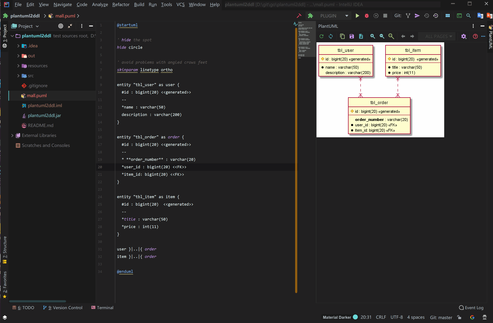

# PlantUML2DDL
Intellij IDEA plugin [PlantUML2DDL](https://plugins.jetbrains.com/plugin/12801-plantuml2ddl) for Mysql DDL and PlantUML [Entity Relationship Diagram](http://plantuml.com/zh/ie-diagram) convert to each other. 

## Installation
Install this plugin both from plugin marketplace and from disk. [Releases page](https://github.com/xwsg/plantuml2ddl/releases)

## Defining Symbol
Symbol| Explain | Example
------|-----|-----
\# | PRIMARY KEY | `#`id : bigint(20)
<\<pk>> | PRIMARY KEY | id : bigint(20) `<<pk>>`
\* | NOT NULL | `*`type : tinyint(4)
<\<notnull>> | NOT NULL | type : tinyint(4) `<<notnull>>`
<\<generated>> | AUTO_INCREMENT | #id : bigint(20) `<<generated>>`
<\<default:{DEFAULT_VALUE}>> | DEFAULT {DEFAULT_VALUE} | *name : varchar(50) `<<default:'anonymous'>>` <br> type : tinyint(4) `<<default:0>>`
--{COLUMN_COMMENT} | column COMMENT '{COLUMN_COMMENT}' | *name : varchar(50) <\<default:'anonymous'>> `--user name`
{TABLE_COMMENT} <br> --/../==/__ | table COMMENT '{TABLE_COMMENT}' | entity "tbl_user" { <br> &nbsp;&nbsp;`table for user` <br> &nbsp;&nbsp;`--` <br> } <br> entity "tbl_user" { <br> &nbsp;&nbsp;`table for user` <br> &nbsp;&nbsp;`..` <br> } <br> entity "tbl_user" { <br> &nbsp;&nbsp;`table for user` <br> &nbsp;&nbsp;`==` <br> }  <br> entity "tbl_user"  { <br> &nbsp;&nbsp;`table for user` <br> &nbsp;&nbsp;`__` <br> }

## Usage
### Convert PlantUML to DDL (Support MySQL or PostgreSQL)
1. Open a PlantUML file
2. In this file, Right-click or Alt-Insert
3. Select `Generate` -> `PlantUML -> MySQL` or `PlantUML -> PostgreSQL`.

For example: `mysql_sample.puml`
```
@startuml aaa

' hide the spot
hide circle

' avoid problems with angled crows feet
skinparam linetype ortho

entity "tbl_user" as user {
  table for user
  --
  #id : bigint(20) <<generated>>
  --
  *type : tinyint(4) <<default:0>> --user type: 0-pc,1-mobile
  *name : varchar(50) <<default:'anonymous'>> -- user name
  description : varchar(200) <<default:'some string'>> --user description
}

entity "tbl_order" as order {
  table for order
  ==
  #id : bigint(20) <<generated>>
  --
  * **order_number** : varchar(20)  <<default:'0'>> -- order number
  *user_id : bigint(20) <<FK>> <<default:0>> -- user id
  *item_id: bigint(20) <<FK>> <<default:0>> -- item id
}

entity "tbl_item" as item {
  table for item
  ..
  #id : bigint(20)  <<generated>>
  --
  title : varchar(50)  <<default: 'wahaha'>> <<notnull>> -- item title
  *price : int(11) <<default: 0>> -- item price
}

user }|..|{ order
item }|..|{ order

@enduml
```



In the current directory, will generate a file `mysql_sample-{yyyyMMddHHmmss}.sql`:

```
create table if not exists `tbl_user` (
    `id` bigint(20) not null auto_increment,
    `type` tinyint(4) not null default 0 comment 'user type: 0-pc,1-mobile',
    `name` varchar(50) not null default 'anonymous' comment 'user name',
    `description` varchar(200) default 'some string' comment 'user description',
    primary key (`id`)
) comment 'table for user';

create table if not exists `tbl_order` (
    `id` bigint(20) not null auto_increment,
    `order_number` varchar(20) not null default '0' comment 'order number',
    `user_id` bigint(20) not null default 0 comment 'user id',
    `item_id` bigint(20) not null default 0 comment 'item id',
    primary key (`id`)
) comment 'table for order';

create table if not exists `tbl_item` (
    `id` bigint(20) not null auto_increment,
    `title` varchar(50) not null default 'wahaha' comment 'item title',
    `price` int(11) not null default 0 comment 'item price',
    primary key (`id`)
) comment 'table for item';

```

### Convert DDL to PlantUML (Only support MySQL)
1. Open a DDL file
2. In this file, Right-click or Alt-Insert
3. Select `Generate` -> `MySQL -> PlantUMLL`.
